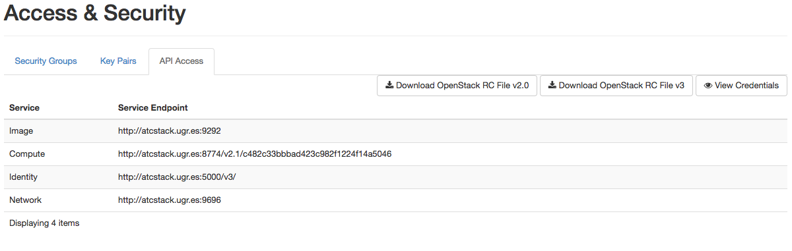

# OpenStack

## Requisitos iniciales

- Tener cuenta de acceso a atcstack.ugr.es.
- Conocimientos básicos del SHELL.
- Conceptos básicos de Cloud y Máquinas Virtuales.

## Credenciales y acceso inicial

Cada alumno tiene asignado un nombre de usuario y una clave que servirán para autenticarse dentro del cluster de OpenStack. 
El nombre de usuario y clave asignado a cada alumno se informará en la primera sesión de prácticas.

El acceso al cluster de OpenStack se realiza a través de los siguientes puntos de entrada (*es necesario estar conectado a la VPN de la UGR*):

- Entorno WEB OpenStack Horizon: http://atcstack.ugr.es/dashboard/auth/login/?next=/dashboard/
- Consola del cluster OpenStack: ssh usuario@atcstack.ugr.es

Para ambos es necesario utilizar las mismas credenciales de acceso.

## Acceso vía WEB

Para acceder vía web, utilizamos un navegador para la dirección:  http://atcstack.ugr.es/dashboard/auth/login/?next=/dashboard/


Por defecto en Domain, usamos ``default``

## Acceso vía SSH

Para usar SSH, utilízalo desde la consola de Linux o bien desde Windows usando la aplicación ``putty``.

Si usas Windows descarga ``putty`` desde: https://www.chiark.greenend.org.uk/~sgtatham/putty/latest.html e indica los siguientes datos en la pantalla de cofiguración:

- Hostname or IP: ``atcstack.ugr.es``
- Port: ``22``
- Connection Type: ``SSH``

Y luego ``Open`` para conectar, donde te pedirá despues las credenciales de acceso.

Si usas SSH desde una consola:

``ssh usuario@atcstack.ugr.es``


## Gestión de OpenStack desde Horizon

Una parte importante de la gestión de OpenStack, se puede realizar desde la interfaz web. Si bien es más limitada que la interfaz de comandos, ofrece una serie de 
elementos básicos para poder realizar la instanciación de Máquinas Virtuales y la configuración y gestión de aspectos sencillos de OpenStack de una forma muy intuitiva.

Esta primera parte de guión nos centraremos en utilizar todo lo que nos ofrece la herramienta web.

### Pantalla inicial

La primera vez que se acceder a OpenStack Horizon, se muestra la siguiente pantalla:


En ella se puede consultar el estado general de nuestra quota de instancias de Máquinas Virtuales y otros recursos que estamos consumiendo como CPUs, RAM o número de redes (IPs).

### Gestión de imagenes

Para acceder a esta sección vamos al menú de la derecha: *Project -> Compute --> Images*.

Se han cargado unas imagenes específicas con las distribuciones de Linux más comunes y que nos permitirán desplegar cualquier software dentro de las prácticas:


Para las prácticas usaremos de forma indistinta: *CirrOS, Fedora27 (yum), Ubuntu16 (apt-get), CentOS7(yum) y CoreOS*.


### Creación de credenciales de usuario (par de claves)

Para poder conectar y acceder por SSH a las intancias que se creen desde OpenStack, es necesario crear un par de claves para la autenticación. Para ello vamos al menú: *Project -> Compute --> Access & Security* y luego la pestaña *KeyPairs*:


Ahora creamos nuestro par de claves utilizando la opción: *Create Key Pair*.


Le asignamos un nombre y luego pulsamos en *Create Key Pair*

Esto automáticamente creará un par de claves que podremos usar para poder conectar a nuestras Máquinas Virtuales, sin necesidad de utilizar usuario/clave, por lo que se facilita bastante la gestión de las imágenes.

Al crear el par de claves, se nos descargará un fichero ``nombre.pem`` que contiene nuestras llave de autenticación que más tarde usaremos.


### Creación de fichero de autenticacion de usuario (RC file)

Para poder interactuar con OpenStack desde el shell, es necesario descargar el fichero de la autenticación del usuario que luego copiaremos a nuestra cuenta en el servidor. Para ello vamos al menú: *Project -> Compute --> Access & Security* y luego la pestaña *API access*:



Para crear el fichero de autenticación de usuario utilizamos la opción ``Download OpenStack RC File v2.0``. Esto descargará en tu navegador el fichero que contiene el script de autenticación para la sesión de OpenStack desde el shell del servidor. El fichero que se descargará sera de la forma: ``CCproject_USUARIO-openrc.sh``.

### Topología de red

Cada alumno, tendrá asignado un conjunto de direcciones IP en las que podrá desplegar Máquinas Virtuales.  Estas IPs serán de la forma ``192.168.0.XXX``. 
Para ver la configuración de red : *Project -> Network --> Network Topology*. 


### Creación de instancias

Para la creación de una instancia, nos vamos a la opción: *Project -> Compute --> Instances*:


Y usamos la opción ``Launch instance``. Antes de crear una instancia es necesario revisar varios aspectos de la creación de instancias:


- En esta pantalla se indicará el Nombre de la Instancia ``Instance name``. La zona de disponibilidad, por defecto dejaremos ``NOVA`` y en ``count`` pondremos ``1``.


- En esta pantalla se indicará la imagen que se usará para la Máquina Virtual que se desplegará. Para este primer ejemplo usaremos Fedora27. Con lo que hacemos click en el botón + para incluirla en el despliegue.


- La selección de un ``flavor`` es importante, ya que es el que nos permite asignarle los recursos a la Máquina Virtual que vamos a crear. Es importante tener en cuenta que el ``flavor`` asignado debe tener caracteristicas que se ajuste a la imagen que vamos a usar; por ejemplo si vamos a usar CentOS7 como imagen y está necesita como mínimo 512 MB de RAM y un espacio en disco de 10GB, tendremos que seleccionar un `flavor` que cubra como mínimo esas características. En caso de no ser así y asignar un `flavor` que no se ajusta, la instanciación de la Máquina Virtual dará error de recursos.
- Para nuestro ejemplo con CentOS7 usamos el `flavor` :

```
m1.medium2	VCPU 1	RAM 512 MB	HD 6 GB
```


- La selección de redes ya viene indicada por defecto, por no es necesario indicar nada. Nuestra red por defecto se llama ``provider``.


- En la sección security por defecto ya viene marcado el grupo de seguridad ``default``. Esto indica que la creación de todas las Máquinas Virtuales, comparten un grupo de seguridad que define filtros y reglas de acceso IP y gestiona el flujo de tráfico de red desde y hacia la instancia.


- En pasos anteriores hemos creado un par de claves para conectar con nuestras instancias. Por defecto viene seleccionado el par de claves que hemos creado en pasos previos. Este par de claves será inyectado dentro de la instancia en tiempo de arranque.

Una vez completados estos pasos, creamos la instancia desde el botón: LAUNCH INSTANCE.

El proceso de instanciación puede durar unos instantes y dependerá del `flavor` usado y sus características. El proceso de arranque de la propia instancia también lleva un tiempo considerable.

La pantalla de gestión de instancias proporciona una visión global del estado de las mismas:


Para conocer los detalles de la instancia, hacemos clic en el nombre de la instancia: 


En esta pantalla se pueden conocer los aspectos detallados de la instancia como los recursos usados, la IP y redes asignadas, los puertos IN/OUT abiertos en la MV, etc. 


Esta pantalla nos permite ver el LOG de arranque de la Instancia, lo cual es muy útil para verificar que la creación de la instancia fue correcta y por ejemplo se le ha asignado bien la RED, o se ha instalado correctamente algún software. Desde esta pantalla no se puede interactuar con la MV, ya que es simplemente informativa. Para poder interactuar con la MV, sin tener que usar SSH, se utiliza la opción Console.


Para conectar con la instancia SIN USAR ssh, a través de QEMU, podemos usar la consola web para verificar que todo está correcto en la MV. No es la mejor opción para interactuar con la MV creada, ya que el tiempo de respuesta es alto. Esta opción simplemente es para poder realizar alguna gestión sin tener que conectar por SSH a la MV.

## Gestión de OpenStack desde el shell


### Inicio de la sesión en el shell

Para poder utilizar OpenStack desde el shell son necesarias 3 cosas:

- Copiar la llave ``.pem`` que se generó en el apartado *Creación de credenciales de usuario (par de claves)*
- Copiar la el fichero de autenticación de la sesion en OpenStack que se ha creado en el apartado *Creación de fichero de autenticacion de usuario (RC file)*
- Conectar por SSH a atcstack.ugr.es


Lo primero que hacemos es copiar los dos ficheros con nuestra llave y script de autenticacion a la cuenta en atcstack.ugr.es. Para ello:

- Abre una nueva consola en tu PC.
- Localiza el fichero PEM y el fichero del script de autenticacion (por defecto en tu carpeta Descargas/Downloads).

y ahora :

- Copia el fichero PEM: 

```
scp fichero.pem tuusuario@atcstack.ugr.es
```

- Copia el fichero de autenticación: 

```
scp CCproject_USUARIO-openrc.sh tuusuario@atcstack.ugr.es
```


Hecho esto conectamos con SSH al servidor atcstack.ugr.es:

```
ssh tuusuario@atcstack.ugr.es
```

Usamos el comando ``ls -l`` y vemos que efectivamente los ficheros copiados están disponibles.


### Autenticación en OpenStack vía Shell

Previamente tenemos que haber conectado al cluster:

```
ssh tuusuario@atcstack.ugr.es
```

Para poder usar autenticar en la session  de OpenStack desde el shell, hacemos:

```
source CCproject_USUARIO-openrc.sh
```

Esto nos pedirá nuestra clave de usuario de OpenStack. Una vez validado el usuario, ya podemos utilizar OpenStack desde el shell.  Para comprobar que todo es correcto:

```
openstack image list
```

El resultado deberá mostrar la lista de imagenes que hay disponibles en la plataforma.

### Identificación de los elementos en OpenStack

Es importante saber que para referenciar elementos en OpenStack se hace utilizando el ``ID`` o el ``Name`` de cada componente. Por ejemplo al hacer un listado de las imágenes disponibles en OpenStack, nos muestra el ``ID`` o el ``Name``, ambos identificadores son válidos para usarlos en la definición de opciones de otros comandos de OpenStack.

### Gestionar las imágenes

Para ello usamos:

```
openstack image OPCIONES
```

Listado de imágenes completo:


```
openstack image list
```


### Gestionar las redes e IPs

Para ello usamos:

```
openstack network OPCIONES
```

Listado de redes disponibles:

```
openstack network list
```

### Gestionar los grupos de seguridad

Para ello usamos:

```
openstack security group OPCIONES
```

Listado de los grupos de seguridad disponibles:


```
openstack security group list
```


### Gestionar los Flavor

Para ello usamos:

```
openstack flavor OPCIONES
```

Listado de flavor:


```
openstack flavor list
```


### Gestionar los pares de claves


Para ello usamos:

```
openstack keypair OPCIONES
```

Listado de claves:

```
openstack keypair list
```


### Crear un instancia

Para crear una instancia, hay que tener en cuenta que como mínimo necesitamos conocer los ``ID`` de los siguientes componentes antes de usar el comando de creación de instancias:

- El ``ID`` de la imagen de Sistema Operativo que se desplegará.
- El ``ID`` del flavor que vamos a utilizar.
- El ``ID`` de la RED que usaremos.
- El ``ID`` del grupo de seguridad que aplicaremos.
- El ``ID`` o ``Name`` del keypair que se usará.

Una vez tengamos todos estos ``ID`` ya podemos lanzar el siguiente comando (ejemplo):

```
openstack server create --flavor XXXXX --image XXXXXX  --nic net-id=XXXXXXX --security-group XXXXXX  --key-name XXXXXXX MI_INSTANCIA
```

El nombre de la instancia viene definido por MI_INSTANCIA, por lo que debes modificar ese valor al que desees.

Al ejecutarlo, obtenemos el resultado del despliegue:

<IMAGEN>

### Crear un instancia con una IP estática

Para crear una instancia con una IP estatica, consulta la tabla de asignaciones de IP para cada alumno. Esto permitirá crear una instancia con una IP concreta y que no sea dinámica como hasta ahora lo hace automáticamente OpenStack en la configuración por defecto de nuestra plataforma.

Para crear una instancia, hay que tener en cuenta que como mínimo necesitamos conocer los ``ID`` de los siguientes componentes antes de usar el comando de creación de instancias:

- El ``ID`` de la imagen de Sistema Operativo que se desplegará.
- El ``ID`` del flavor que vamos a utilizar.
- El ``ID`` de la RED que usaremos.
- El ``ID`` del grupo de seguridad que aplicaremos.
- El ``ID`` o ``Name`` del keypair que se usará.

Una vez tengamos todos estos ``ID`` ya podemos lanzar el siguiente comando, teniendo en cuenta la opción ``v4-fixed-ip`` donde se especifica la IP concreta que tendrá la instancia.

```
openstack server create --flavor XXXXX --image XXXXXX  --nic net-id=XXXXXX,v4-fixed-ip=192.168.0.XXX --security-group XXXXXX  --key-name XXXXXXX MI_INSTANCIAIP
```
	

### Consultar instancias

Para consultar instancias utilizamos:

Listado de claves:

```
openstack server list
```

Para ver en detalle todos los aspectos de la instancia utilizamos:


```
openstack server show <ID/Name>
```

### Gestionar las instancias (estados y acciones)

Estados de las instancias:


Pausado de la instancia. Esto almacenrá el estado de la instancia en la RAM y parará la MV.

```
openstack server pause <ID/Name>
```

Para volver a restaurar el estado anterior:

```
openstack server unpause <ID/Name>
```

Suspendido de la instancia. Esto almacerá el estado de la MV y los datos en disco y para la MV. Esta acción libera la CPU y la RAM ocupada por la Mv. Al reanudar la instancia, adquiere de nuevo los recursos.
```
openstack server suspend <ID/Name>
```

Reanudación de la instancia desde el estado de suspendida o pausada:
```
openstack server resume <ID/Name>
```

Borrado de una instancia. Elimina por completo la instancia:

```
openstack server delete <ID/Name>
```

Crear un snapshot del volumen de la instancia:

```
openstack volume snapshot create --volume <IDVOLUME> --force NOMBRESNAPSHOT
```

Previamente debemos ver los volúmenes que tenemos activos:

```
openstack volume list
```

Para borrar un volumen:

```
openstack volume delete <ID/Name>
```

### Acceso SSH a las instancias

Para acceder a todas las instancias que hemos creado, previamente debemos tener copiado en nuestro $HOME de atcstack el fichero ``.pem`` correspondiente. 

Hay que cambiar los permisos del fichero ``.pem`` antes de usarlo con ssh:

```
chmod 400 fichero.pem
```

El acceso desde dentro de ATCSTACK se realiza del siguiente modo (usa como usuario, el correspondiente de cada imagen: en CirrOS es ``cirros``, en fedora27 es ``fedora``)

```
ssh -i fichero.pem root@192.168.0.XXX
```

(donde 192.168.0.XXX corresponderá con la IP que la instancia tiene asignada (``openstack server list`` para verlo))

*NO* preguntará por la clave de acceso a la instancia.


