# OpenStack

## Requisitos iniciales

- Tener cuenta de acceso a atcstack.ugr.es.
- Conocimientos básicos del SHELL.
- Conceptos básicos de Cloud y Máquinas Virtuales.

## Credenciales y acceso inicial

Cada alumno tiene asignado un nombre de usuario y una clave que servirán para autenticarse dentro del cluster de OpenStack. 
El nombre de usuario y clave asignado a cada alumno se informará en la primera sesión de prácticas.

El acceso al cluster de OpenStack se realiza a través de los siguientes puntos de entrada (*es necesario estar conectado a la VPN de la UGR*):

- Entorno WEB OpenStack Horizon: http://atcstack.ugr.es/dashboard/auth/login/?next=/dashboard/
- Consola del cluster OpenStack: ssh usuario@atcstack.ugr.es

Para ambos es necesario utilizar las mismas credenciales de acceso.

## Acceso vía WEB

Para acceder vía web, utilizamos un navegador para la dirección:  http://atcstack.ugr.es/dashboard/auth/login/?next=/dashboard/


Por defecto en Domain, usamos ``default``

## Acceso vía SSH

Para usar SSH, utilízalo desde la consola de Linux o bien desde Windows usando la aplicación ``putty``.

Si usas Windows descarga ``putty`` desde: https://www.chiark.greenend.org.uk/~sgtatham/putty/latest.html e indica los siguientes datos en la pantalla de cofiguración:

- Hostname or IP: ``atcstack.ugr.es``
- Port: ``22``
- Connection Type: ``SSH``

Y luego ``Open`` para conectar, donde te pedirá despues las credenciales de acceso.

Si usas SSH desde una consola:

``ssh usuario@atcstack.ugr.es``


## Gestión de OpenStack desde Horizon

Una parte importante de la gestión de OpenStack, se puede realizar desde la interfaz web. Si bien es más limitada que la interfaz de comandos, ofrece una serie de 
elementos básicos para poder realizar la instanciación de Máquinas Virtuales y la configuración y gestión de aspectos sencillos de OpenStack de una forma muy intuitiva.

Esta primera parte de guión nos centraremos en utilizar todo lo que nos ofrece la herramienta web.

### Pantalla inicial

La primera vez que se acceder a OpenStack Horizon, se muestra la siguiente pantalla:

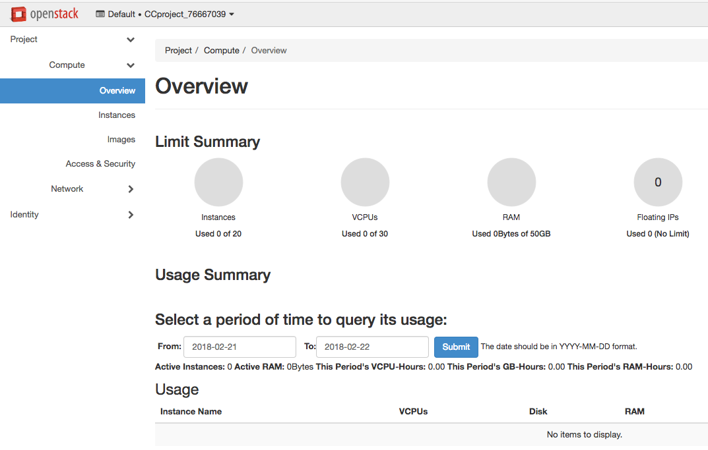

En ella se puede consultar el estado general de nuestra quota de instancias de Máquinas Virtuales y otros recursos que estamos consumiendo como CPUs, RAM o número de redes (IPs).

### Gestión de imagenes

Para acceder a esta sección vamos al menú de la derecha: *Project -> Compute --> Images*.

Se han cargado unas imagenes específicas con las distribuciones de Linux más comunes y que nos permitirán desplegar cualquier software dentro de las prácticas:

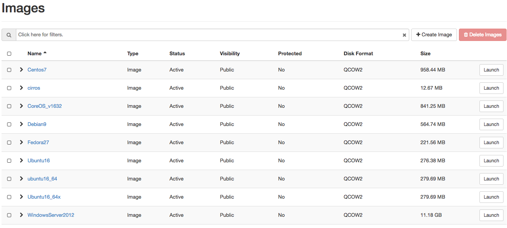

Para las prácticas usaremos de forma indistinta: *CirrOS, Fedora27 (yum), Ubuntu16 (apt-get), CentOS7(yum) y CoreOS*.


## Creación de credenciales de usuario (par de claves)

Para poder conectar y acceder por SSH a las intancias que se creen desde OpenStack, es necesario crear un par de claves para la autenticación. Para ello vamos al menú: *Project -> Compute --> Access & Security* y luego la pestaña *KeyPairs*:

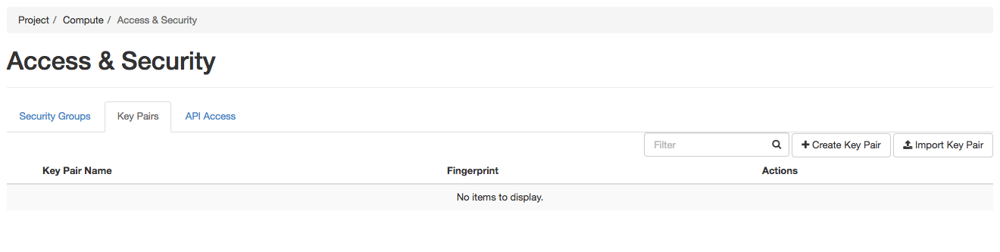

Ahora creamos nuestro par de claves utilizando la opción: *Create Key Pair*.

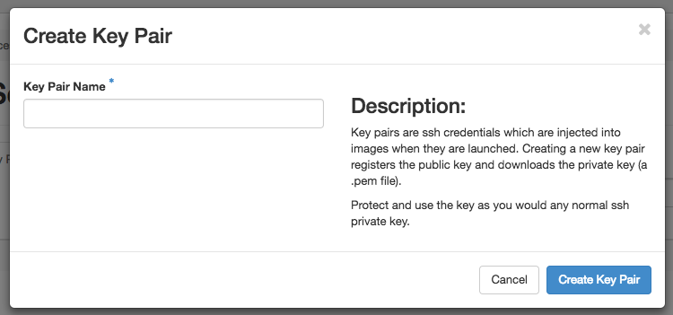

Le asignamos un nombre y luego pulsamos en *Create Key Pair*

Esto automáticamente creará un par de claves que podremos usar para poder conectar a nuestras Máquinas Virtuales, sin necesidad de utilizar usuario/clave, por lo que se facilita bastante la gestión de las imágenes.

Al crear el par de claves, se nos descargará un fichero ``nombre.pem`` que contiene nuestras llave de autenticación que más tarde usaremos.

## Topología de red

Cada alumno, tendrá asignado un conjunto de direcciones IP en las que podrá desplegar Máquinas Virtuales.  Estas IPs serán de la forma ``192.168.0.XXX``. 
Para ver la configuración de red : *Project -> Network --> Network Topology*. 

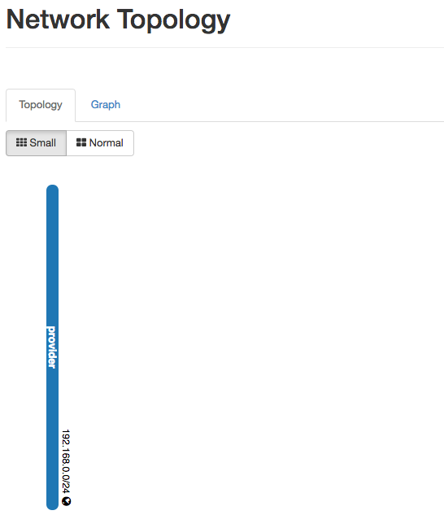

## Creación de instancias

Para la creación de una instancia, nos vamos a la opción: *Project -> Compute --> Instances*:


Y usamos la opción ``Launch instance``. Antes de crear una instancia es necesario revisar varios aspectos de la creación de instancias:

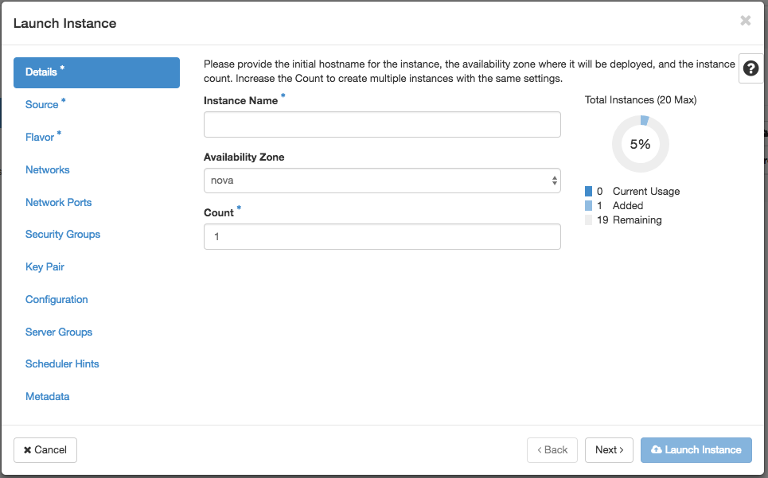

- En esta pantalla se indicará el Nombre de la Instancia ``Instance name``. La zona de disponibilidad, por defecto dejaremos ``NOVA`` y en ``count`` pondremos ``1``.


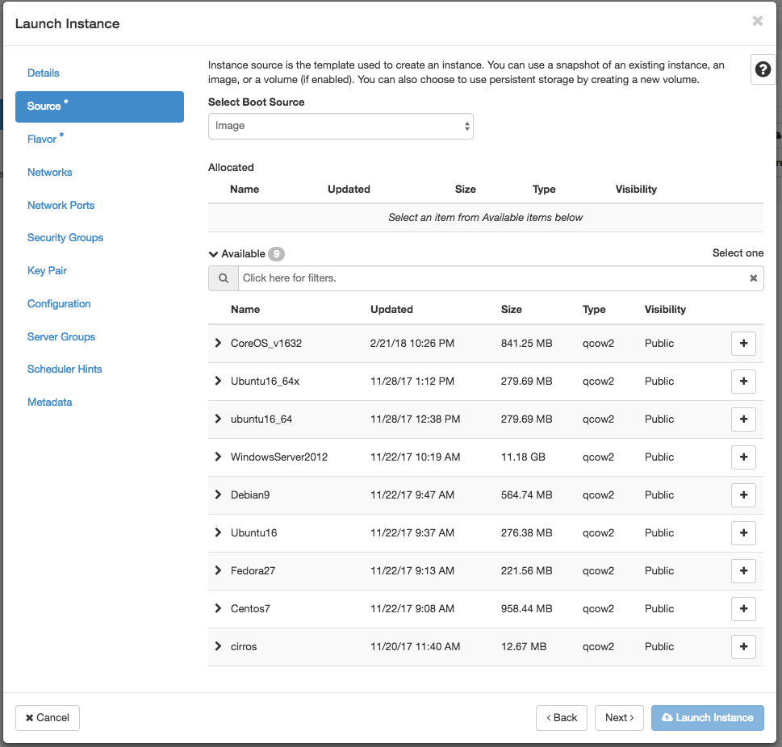

- En esta pantalla se indicará la imagen que se usará para la Máquina Virtual que se desplegará. Para este primer ejemplo usaremos Fedora27. Con lo que hacemos click en el botón + para incluirla en el despliegue.


- La selección de un ``flavor`` es importante, ya que es el que nos permite asignarle los recursos a la Máquina Virtual que vamos a crear. Es importante tener en cuenta que el ``flavor`` asignado debe tener caracteristicas que se ajuste a la imagen que vamos a usar; por ejemplo si vamos a usar CentOS7 como imagen y está necesita como mínimo 512 MB de RAM y un espacio en disco de 10GB, tendremos que seleccionar un `flavor` que cubra como mínimo esas características. En caso de no ser así y asignar un `flavor` que no se ajusta, la instanciación de la Máquina Virtual dará error de recursos.
- Para nuestro ejemplo con CentOS7 usamos el `flavor` :

```
m1.medium2	VCPU 1	RAM 512 MB	HD 6 GB
```

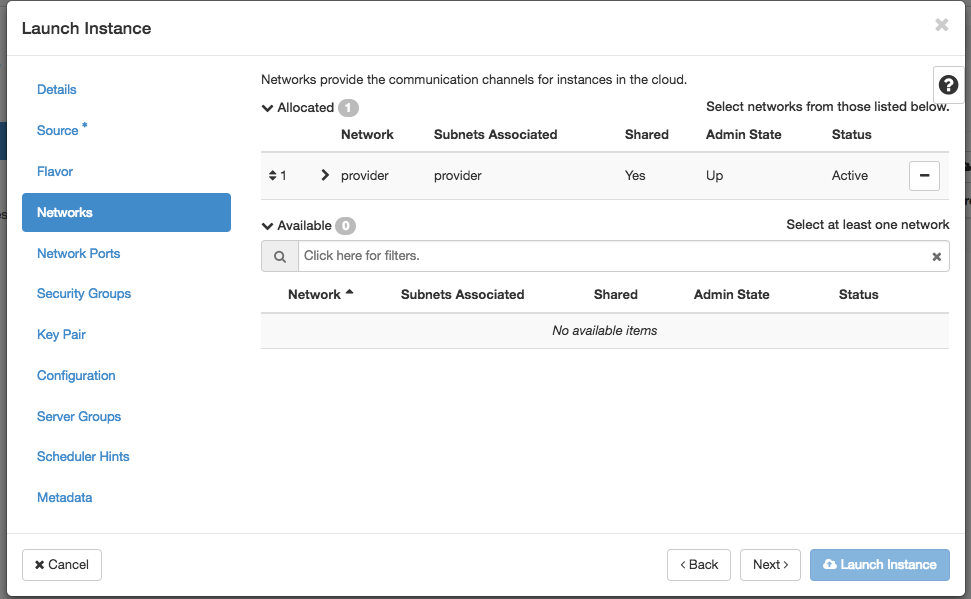

- La selección de redes ya viene indicada por defecto, por no es necesario indicar nada. Nuestra red por defecto se llama ``provider``.

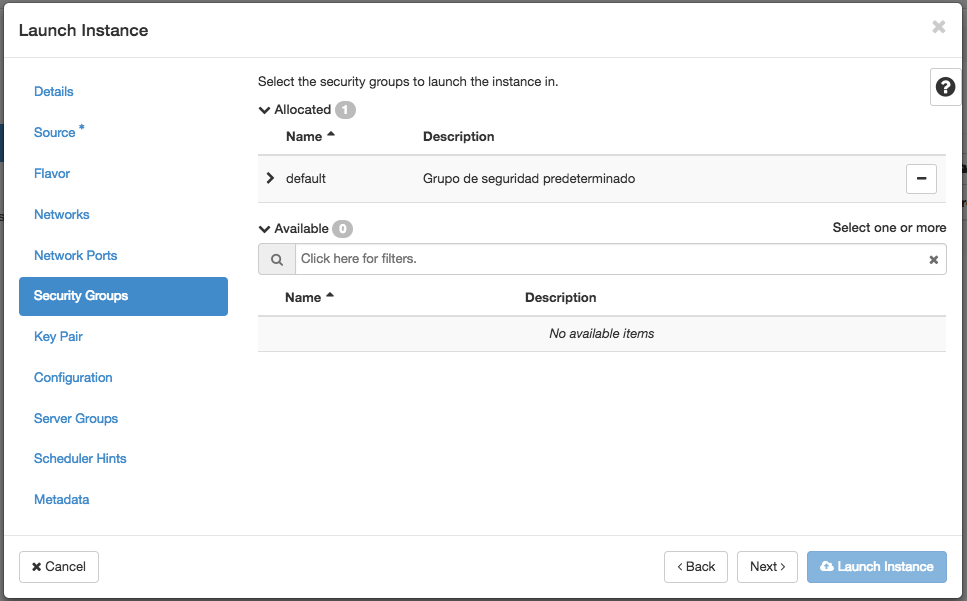

- En la sección security por defecto ya viene marcado el grupo de seguridad ``default``. Esto indica que la creación de todas las Máquinas Virtuales, comparten un grupo de seguridad que define filtros y reglas de acceso IP y gestiona el flujo de tráfico de red desde y hacia la instancia.

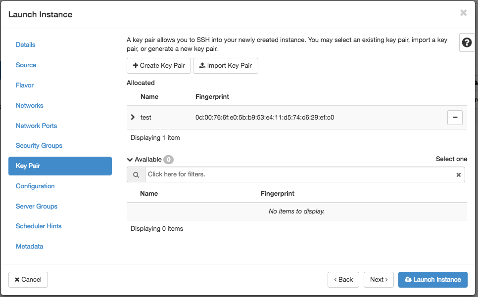

- En pasos anteriores hemos creado un par de claves para conectar con nuestras instancias. Por defecto viene seleccionado el par de claves que hemos creado en pasos previos. Este par de claves será inyectado dentro de la instancia en tiempo de arranque.

Una vez completados estos pasos, creamos la instancia desde el botón: LAUNCH INSTANCE.

El proceso de instanciación puede durar unos instantes y dependerá del `flavor` usado y sus características. El proceso de arranque de la propia instancia también lleva un tiempo considerable.

La pantalla de gestión de instancias proporciona una visión global del estado de las mismas:


Para conocer los detalles de la instancia, hacemos clic en el nombre de la instancia: 


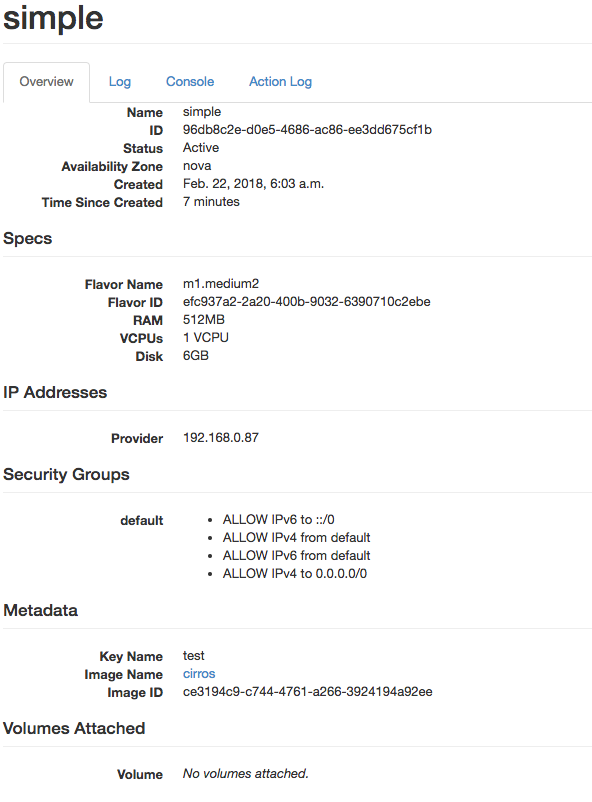

En esta pantalla se pueden conocer los aspectos detallados de la instancia como los recursos usados, la IP y redes asignadas, los puertos IN/OUT abiertos en la MV, etc. 


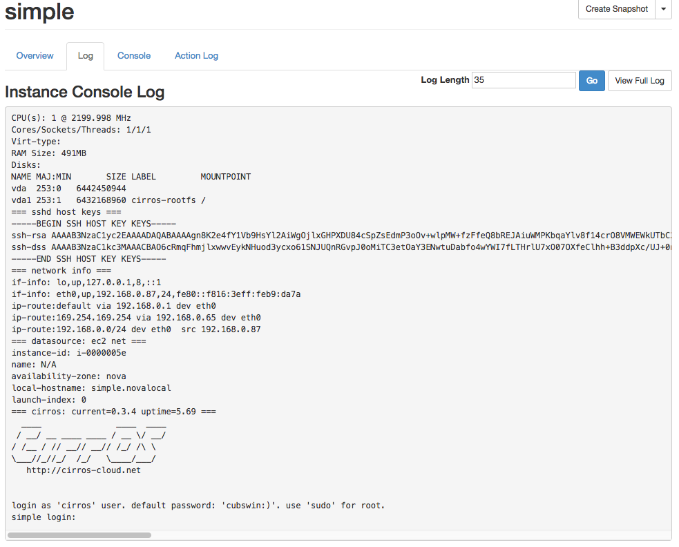

Esta pantalla nos permite ver el LOG de arranque de la Instancia, lo cual es muy útil para verificar que la creación de la instancia fue correcta y por ejemplo se le ha asignado bien la RED, o se ha instalado correctamente algún software. Desde esta pantalla no se puede interactuar con la MV, ya que es simplemente informativa. Para poder interactuar con la MV, sin tener que usar SSH, se utiliza la opción Console.

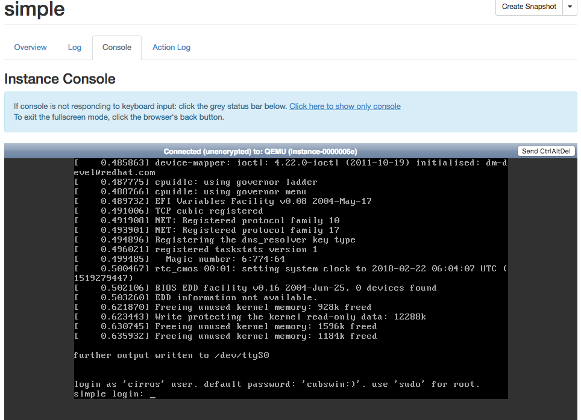

Para conectar con la instancia SIN USAR ssh, a través de QEMU, podemos usar la consola web para verificar que todo está correcto en la MV. No es la mejor opción para interactuar con la MV creada, ya que el tiempo de respuesta es alto. Esta opción simplemente es para poder realizar alguna gestión sin tener que conectar por SSH a la MV.


