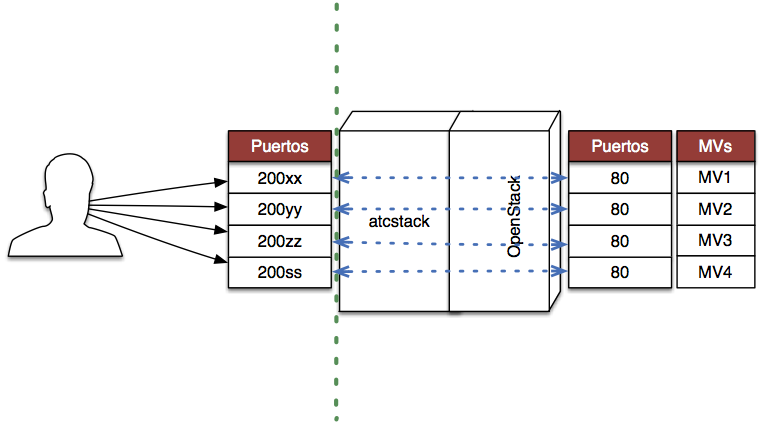

Asignatura Cloud Computing del Máster en Ingeniería Informática. 

Departamento de Ciencias de la Computación e Inteligencia Artificial.

Universidad de Granada.

<HR>

Profesor: **Manuel J. Parra-Royón**

Email: **manuelparra@decsai.ugr.es**

Tutorías: **Viernes, de 17:30 a 18:30, despacho D31 (4ª planta) Escuela Técnica Superior de Ingenierías Informática y de Telecomunicación (ETSIIT).**

Material de prácticas de la asignatura: **https://github.com/manuparra/PracticasCC**

<HR>


# Esquema de red externa e interna. Redirección de puertos.

La estructura de red que disponemos para las prácticas es la siguiente:



Se compone de dos partes:

- Pública; donde el cluster atcstack.ugr.es expone para cada usuario 4 puertos de la serie 200XX.
- Privada; desde openstack se pueden crear hasta 4 MV para las prácticas.

Cada usuario tiene disponible un rango de direcciones IP locales para asignarlo a las MVs. 

Cada puerto externo está asociado a una IP local y al puerto 80 de esa IP local, de modo que el esquema grafico de una conexión sería:

*Recuerda que debes estar conectado a la VPN para acceder al cluster de openstack.*


```
Usuario <-----> puerto 20002 <-----> ATCSTACK <-----> 192.168.0.112:80
```

Esto hace que tengamos que tener en cuenta que hay que abrir el puerto 80 de la Máquina Virtual que corresponda y además añadir la política de seguridad y regla concreta para que esté disponible este puerto.


# Rango de IPs para los usuarios

Cada usuario tiene asignado un rango de puertos externos y un rango de IP correspondiente y asociado a esos puertos.

Para evitar que varios usuarios usen la misma IP, hay siempre que revisar el listado de IPs propias y lanzar las instancias dentro del rango de IP asignado a cada usuario.

- Usuario *CC_....52*
 - Puerto externo: ``20000`` ---> ``192.168.0.110``
 - Puerto externo: ``20001`` ---> ``192.168.0.111``
 - Puerto externo: ``20002`` ---> ``192.168.0.112``
 - Puerto externo: ``20003`` ---> ``192.168.0.113``
- Usuario *CC_....79*
 - Puerto externo: ``20004`` ---> ``192.168.0.114``
 - Puerto externo: ``20005`` ---> ``192.168.0.115``
 - Puerto externo: ``20006`` ---> ``192.168.0.116``
 - Puerto externo: ``20007`` ---> ``192.168.0.117``
- Usuario *CC_....59*
 - Puerto externo: ``20008`` ---> ``192.168.0.118``
 - Puerto externo: ``20009`` ---> ``192.168.0.119``
 - Puerto externo: ``20010`` ---> ``192.168.0.120``
 - Puerto externo: ``20011`` ---> ``192.168.0.121``
- Usuario *CC_....76*
 - Puerto externo: ``20012`` ---> ``192.168.0.122``
 - Puerto externo: ``20013`` ---> ``192.168.0.123``
 - Puerto externo: ``20014`` ---> ``192.168.0.124``
 - Puerto externo: ``20015`` ---> ``192.168.0.125``
- Usuario *CC_....86*
 - Puerto externo: ``20016`` ---> ``192.168.0.126``
 - Puerto externo: ``20017`` ---> ``192.168.0.127``
 - Puerto externo: ``20018`` ---> ``192.168.0.128``
 - Puerto externo: ``20019`` ---> ``192.168.0.129``
- Usuario *CC_....10*
 - Puerto externo: ``20020`` ---> ``192.168.0.130``
 - Puerto externo: ``20021`` ---> ``192.168.0.131``
 - Puerto externo: ``20022`` ---> ``192.168.0.132``
 - Puerto externo: ``20023`` ---> ``192.168.0.133``
- Usuario *CC_....70*
 - Puerto externo: ``20024`` ---> ``192.168.0.134``
 - Puerto externo: ``20025`` ---> ``192.168.0.135``
 - Puerto externo: ``20026`` ---> ``192.168.0.136``
 - Puerto externo: ``20027`` ---> ``192.168.0.137``
- Usuario *CC_....60*
 - Puerto externo: ``20028`` ---> ``192.168.0.138``
 - Puerto externo: ``20029`` ---> ``192.168.0.139``
 - Puerto externo: ``20030`` ---> ``192.168.0.140``
 - Puerto externo: ``20031`` ---> ``192.168.0.141``
- Usuario *CC_....39*
 - Puerto externo: ``20032`` ---> ``192.168.0.142``
 - Puerto externo: ``20033`` ---> ``192.168.0.143``
 - Puerto externo: ``20034`` ---> ``192.168.0.144``
 - Puerto externo: ``20035`` ---> ``192.168.0.145``
- Usuario *CC_....73*
 - Puerto externo: ``20036`` ---> ``192.168.0.146``
 - Puerto externo: ``20037`` ---> ``192.168.0.147``
 - Puerto externo: ``20038`` ---> ``192.168.0.148``
 - Puerto externo: ``20039`` ---> ``192.168.0.149``
- Usuario *CC_....59*
 - Puerto externo: ``20040`` ---> ``192.168.0.150``
 - Puerto externo: ``20041`` ---> ``192.168.0.151``
 - Puerto externo: ``20042`` ---> ``192.168.0.152``
 - Puerto externo: ``20043`` ---> ``192.168.0.153``
- Usuario *CC_....95*
 - Puerto externo: ``20044`` ---> ``192.168.0.154``
 - Puerto externo: ``20045`` ---> ``192.168.0.155``
 - Puerto externo: ``20046`` ---> ``192.168.0.156``
 - Puerto externo: ``20047`` ---> ``192.168.0.157``
- Usuario *CC_....02*
 - Puerto externo: ``20048`` ---> ``192.168.0.158``
 - Puerto externo: ``20049`` ---> ``192.168.0.159``
 - Puerto externo: ``20050`` ---> ``192.168.0.160``
 - Puerto externo: ``20051`` ---> ``192.168.0.161``


