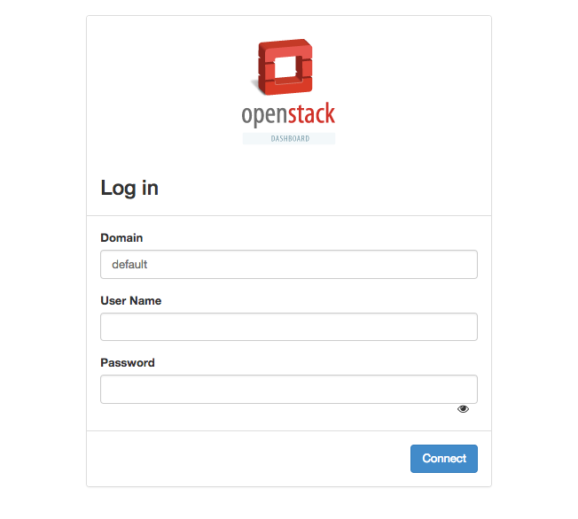
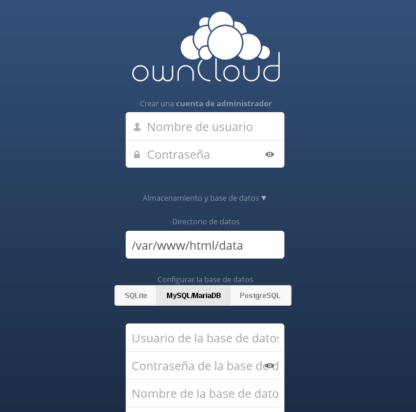

Asignatura Cloud Computing del Máster en Ingeniería Informática. 

Departamento de Ciencias de la Computación e Inteligencia Artificial.

Universidad de Granada.

<HR>

Profesor: **Manuel J. Parra-Royón**

Email: **manuelparra@decsai.ugr.es**

Tutorías: **Viernes, de 17:30 a 18:30, despacho D31 (4ª planta) Escuela Técnica Superior de Ingenierías Informática y de Telecomunicación (ETSIIT).**

Material de prácticas de la asignatura: **https://github.com/manuparra/PracticasCC**

<HR>


# Sesión : Despliegue de servicios en contenedores

Tabla de contenido:

  * [Credenciales y acceso inicial](#credenciales-y-acceso-inicial)
  * [Acceso vía WEB](#acceso-v-a-web)
  * [Acceso vía SSH](#acceso-v-a-ssh)
  * [Despliegue automatico de servicios y software](#despliegue-automatico-de-servicios-y-software)
    + [Creación de script de inicio/parada y orquestación de MVs](#creaci-n-de-script-de-inicio-parada-y-orquestaci-n-de-mvs)
  * [Contenedores con DOCKER](#contenedores-con-docker)
    + [VIRTUAL MACHINES](#virtual-machines)
    + [CONTAINERS](#containers)
    + [KATAContainers](#katacontainers)
  * [Ventajas de DOCKER](#ventajas-de-docker)
  * [Despliegue de Contenedores](#despliegue-de-contenedores)
    + [Instalación de DOCKER en tiempo de instanciación](#instalaci-n-de-docker-en-tiempo-de-instanciaci-n)
    + [Trabajo con DOCKER: Gestión de contenedores](#trabajo-con-docker--gesti-n-de-contenedores)
      - [Parametrización de contenedores con DOCKER](#parametrizaci-n-de-contenedores-con-docker)
    + [Creación de contenedores enlazados](#creaci-n-de-contenedores-enlazados)
      - [Maquina Virtual 1](#maquina-virtual-1)
      - [Maquina Virtual 2](#maquina-virtual-2)
    + [Instalación del servicio completo OWNCLOUD + MYSQL](#instalaci-n-del-servicio-completo-owncloud---mysql)


## Requisitos iniciales

- Tener cuenta de acceso a atcstack.ugr.es.
- Conocimientos básicos del SHELL.
- Conceptos básicos de Cloud y Máquinas Virtuales.

## Credenciales y acceso inicial

Cada alumno tiene asignado un nombre de usuario y una clave que servirán para autenticarse dentro del cluster de OpenStack. 
El nombre de usuario y clave asignado a cada alumno se informará en la primera sesión de prácticas.

El acceso al cluster de OpenStack se realiza a través de los siguientes puntos de entrada (*es necesario estar conectado a la VPN de la UGR*):

- Entorno WEB OpenStack Horizon: http://atcstack.ugr.es/dashboard/auth/login/?next=/dashboard/
- Consola del cluster OpenStack: ssh usuario@atcstack.ugr.es

Para ambos es necesario utilizar las mismas credenciales de acceso.

## Acceso vía WEB

Para acceder vía web, utilizamos un navegador para la dirección:  http://atcstack.ugr.es/dashboard/auth/login/?next=/dashboard/




Por defecto en Domain, usamos ``default``

## Acceso vía SSH

Para usar SSH, utilízalo desde la consola de Linux o bien desde Windows usando la aplicación ``putty``.

Si usas Windows descarga ``putty`` desde: https://www.chiark.greenend.org.uk/~sgtatham/putty/latest.html e indica los siguientes datos en la pantalla de cofiguración:

- Hostname or IP: ``atcstack.ugr.es``
- Port: ``22``
- Connection Type: ``SSH``

Y luego ``Open`` para conectar, donde te pedirá despues las credenciales de acceso.

Si usas SSH desde una consola:

``ssh usuario@atcstack.ugr.es``


## Despliegue automatico de servicios y software

### Creación de script de inicio/parada y orquestación de MVs

La primera parte de esta sesión se destinará a explicar el desarrollo de un **script** a través del cual se puedan instanciar las MV a demanda, además de eliminarlas de una forma cómoda. Esto servirá para ir avanzando en la primera práctica del curso.

El **script** recibirá los parámetros siguientes:

- Acción: Crear / Eliminar
- Nombre clave de las MVs (por ejemplo *CCManu_*)
- Flavour a utilizar para todas (nombre)
- Red a usar (nombre de Red)
- Imagen a usar (nombre de la imagen)
- Grupo de seguridad
- Fichero de CloudINIT (con update de paquetes, etc.) (opcional)
- Fichero de ANSIBLE para el software a desplegar (opcional)

Necesitarás conocer:

- Programación en BASH o utilizar el lenguaje que más te guste
- Instanciación de MV con OpenStack
- Uso de Cloud-Init

Un ejemplo de script.sh

```
#!/bin/bash

#Accion
accion = $1

# Flavor
flavor = $2

...

# Para cada una de las IPs que tenemos asignadas:

openstack create server --flavor $flavor .... CC_MV_01_$name ... --user-data software.sh
openstack create server --flavor $flavor .... CC_MV_02_$name ... --user-data software.sh

```

La llamada sería:

```
sh crearcluster.sh crear m1.medium MisMVs RedPredeterminada ....
```

Hay que tener en cuenta lo siguiente en el script:

- Debe permitir **crear** las máquinas y **borrarlas**.
- Debe crear 4 MVs cada una con su IP del rango propio de cada alumno.
- El software instalado sera:
  - MV1: Update de paquetes y NGINX.
  - MV2: Update de paquetes y docker + owcloud en contenedor
  - MV3: Update de paquetes y docker + owcloud en contenedor
  - MV4: Update de paquetes y docker + (mysql y LDAP) en contenedor


## Contenedores con DOCKER

### VIRTUAL MACHINES

Las máquinas virtuales incluyen la aplicación, los binarios y bibliotecas necesarios, y un sistema operativo **entero de invitados**, todos los cuales pueden llegar a tener decenas de GBs.


### CONTAINERS

Los contenedores incluyen la aplicación y todas sus dependencias, pero **comparten el kernel con otros contenedores, ejecutándose como procesos aislados en el espacio de usuario del sistema operativo host**. Los contenedores Docker no están vinculados a ninguna infraestructura específica: se ejecutan en cualquier ordenador, en cualquier infraestructura y en cualquier nube.

### KATAContainers

Kata Containers es un nuevo proyecto de código abierto que construye máquinas virtuales extremadamente ligeras que se conectan perfectamente al ecosistema de contenedores.

Kata Containers es un proyecto de código abierto y la comunidad que trabaja para construir una implementación estándar de Máquinas Virtuales (VMs) ligeras que se sienten y funcionan como contenedores, pero proporcionan las ventajas de aislamiento de carga de trabajo y seguridad de las máquinas virtuales.

Kata Containers es un proyecto de código abierto y la comunidad que trabaja para construir una implementación estándar de Máquinas Virtuales (VMs) ligeras que se sienten y funcionan como contenedores, pero proporcionan las ventajas de aislamiento de carga de trabajo y seguridad de las máquinas virtuales.


## Ventajas de DOCKER

**Desarrollo rápido**

Deje de perder horas configurando entornos de desarrollador, creando nuevas instancias y haciendo copias del código de producción para ejecutar localmente. Con Docker, simplemente tome copias de su entorno en directo y ejecútelas en cualquier punto final nuevo que ejecute un motor Docker.

**Trabajo confortablemente**

Las capacidades de aislamiento de los contenedores Docker liberan a los desarrolladores de limitaciones: pueden utilizar el mejor lenguaje y las mejores herramientas para sus servicios de aplicaciones sin preocuparse de causar conflictos internos de herramientas.

**Olvídate de las inconsistencias.**

Embalaje de una aplicación en un contenedor con sus configuraciones y dependencias garantiza que la aplicación funcionará siempre según lo diseñado en cualquier entorno: localmente, en otra máquina, en prueba o producción. No más preocupaciones de tener que instalar las mismas configuraciones en diferentes entornos.

**Comparte tus contenedores.**

Almacene, distribuya y administre imágenes Docker en Docker Hub con su equipo. Las actualizaciones, los cambios y el historial de imágenes se comparten automáticamente en toda la organización.

**Escala**

Docker le permite cambiar dinámicamente su aplicación, desde añadir nuevas capacidades y escalar servicios, hasta cambiar rápidamente las áreas problemáticas.

Los contenedores Docker giran hacia arriba y hacia abajo en segundos, lo que facilita escalar los servicios de aplicación para satisfacer la demanda máxima del cliente, y luego reducir los contenedores en funcionamiento.

Docker facilita la identificación de problemas, aísla el contenedor del problema, vuelve rápidamente para hacer los cambios necesarios, y luego empuja el contenedor actualizado a la producción. El aislamiento entre contenedores hace que estos cambios sean menos perturbadores que en los modelos de software tradicionales.


**Multiplataforma**

Docker se ejecuta en Windows, Mac y Linux.


## Despliegue de Contenedores

Para empezar a trabajar con los contenedores, usaremos varias MVs creadas desde OpenStack. Estas MVs deben tener instalado Docker para poder trabajar con los servicios de contenedores.

Para ello, necesitamos:

- Crear una Máquina Virtual con una IP de la lista de IPs de usuario.
- Instalarle el software:
  - En tiempo de instanciacion con CLOUD-INIT
  - En tiempo de ejecución con ANSIBLE

### Instalación de DOCKER en tiempo de instanciación

Para poder tener DOCKER en tiempo de instanciación es necesario al crear la MV desde OpenStack, utilizar la directiva ``--user-data`` y crear un fichero ``bash`` con el nombre por ejemplo de ``setupdocker.sh`` con los siguientes comandos:

```
#!/bin/bash

yum update

yum -y install docker

systemctl start docker

systemctl enable docker

```

De modo que la llamada a openstack será:

```
openstack server create ..... --user-data setupdocker.sh
```

Ahora nos conectamos a la MV recien creada, que deberá tener instalado DOCKER, y comenzamos a usar los comandos de Docker:

### Trabajo con DOCKER: Gestión de contenedores

Nos conectamos a la MV recien creada con 

```
ssh -i fichero.pem fedora@<tu IP asignada>
```

Primero de todo, comprueba que tienes acceso al sistema docker, prueba este comando:

```
docker run hello-world
```

Y le devolverá un mensaje en el que se mostrará que su instalación parece estar funcionando correctamente y podrá utilizarla.

Para crear un nuevo contenedor en Docker, se puede hacer de dos maneras: 

- por una parte, creando un archivo docker (link) o bien 

- descargando / usando un contenedor que ya ha sido creado por otros usuarios.

Los contenedores ya creados disponibles para su uso se almacenan en un tipo de mercado de contenedores en https://hub.docker.com/. Prácticamente cualquier cosa que usted piense ya estará acoplado. 

Pero también puedes construir tu propio contenedor con todo lo que necesites. Por ejemplo un contenedor que tenga su aplicación completa con todas sus dependencias, mezclando p. ej. php, mysql, nginx, etc. en el mismo contenedor o en contenedores diferentes.

Lo primero que necesitamos es descargar la imagen docker de nginx, para ello comprobamos si la imagen está en la lista de imágenes disponibles:

```
docker images
```

Si la imagen no se encuentra localmente, Docker la sacará de Docker Hub y la usará:

```
docker pull nginx
```

Descargará la imagen del contenedor nginx. 

Y ahora puedes ver si la imagen está en el repositorio de imágenes usando:

```
docker images
```

```
REPOSITORY                        TAG                 IMAGE ID            CREATED             SIZE
docker.io/nginx                   latest              abf312888d13        12 days ago         181.5 MB
...
```

Ejecute el container, utilizando la siguiente sintaxis:

```
docker run -d -p <yourport>:<containerport> --name <mynameofcontainer> <container>
```

Opciones:

``-d Run container in background and print container ID``

``-p Publish a container's port(s) to the host``

``--name Name of your contaniner i.e. 'containerofmanuparra'``

``<container> This is the container that will be executed`` 

Así que ejecutamos:

```
docker run -d -p <yourport>:80 --name testnginx nginx
```

En  ``<yourport>`` escribe el número de tu puerto asignado en la lista de puertos, aunque al ser un contenedor local a la MV se usará el mismo puerto de Entrada como de Salida.

Para comprobar que el contendore está lanzado:

```
docker ps
```

Esto devuelve:

```
CONTAINER ID        IMAGE               COMMAND                  CREATED             STATUS              PORTS                            NAMES
52ad2efb9fff        nginx               "nginx -g 'daemon off"   12 minutes ago      Up 12 minutes       443/tcp, 0.0.0.0:14000->80/tcp   testnginx
...
```

Donde ``container ID`` es el único ID de su Contenedor. Puede utilizar el ID de contenedor o NOMBRES para referirse a su contenedor. ``IMAGE`` es el nombre de la imagen contenedor. "PORTS" muestra la correspondencia de los puertos entre el servidor y el contenedor docker.


Y ahora, ve a tu navegador y escribe (cuando este disponible):

```
http://atcstack.ugr.es:<yourport>/
```

En caso contrario, usa tu sessión con X-Forwarding para SSH, con lo que tendrás que usar:

```
http://IPASIGNADAMV:<yourport>/
```

En ``<yourport>`` debes poner 80 si lo has dejado por defecto en el contenedor.


#### Parametrización de contenedores con DOCKER

DOCKER tienen una gran capacidad de parametrización de los contenedores:

```
      --add-host value              Add a custom host-to-IP mapping (host:ip) (default [])
  -a, --attach value                Attach to STDIN, STDOUT or STDERR (default [])
      --blkio-weight value          Block IO (relative weight), between 10 and 1000
      --blkio-weight-device value   Block IO weight (relative device weight) (default [])
      --cap-add value               Add Linux capabilities (default [])
      --cap-drop value              Drop Linux capabilities (default [])
      --cgroup-parent string        Optional parent cgroup for the container
      --cidfile string              Write the container ID to the file
      --cpu-percent int             CPU percent (Windows only)
      --cpu-period int              Limit CPU CFS (Completely Fair Scheduler) period
      --cpu-quota int               Limit CPU CFS (Completely Fair Scheduler) quota
  -c, --cpu-shares int              CPU shares (relative weight)
      --cpuset-cpus string          CPUs in which to allow execution (0-3, 0,1)
      --cpuset-mems string          MEMs in which to allow execution (0-3, 0,1)
  -d, --detach                      Run container in background and print container ID
      --detach-keys string          Override the key sequence for detaching a container
      --device value                Add a host device to the container (default [])
      --device-read-bps value       Limit read rate (bytes per second) from a device (default [])
      --device-read-iops value      Limit read rate (IO per second) from a device (default [])
      --device-write-bps value      Limit write rate (bytes per second) to a device (default [])
      --device-write-iops value     Limit write rate (IO per second) to a device (default [])
      --disable-content-trust       Skip image verification (default true)
      --dns value                   Set custom DNS servers (default [])
      --dns-opt value               Set DNS options (default [])
      --dns-search value            Set custom DNS search domains (default [])
      --entrypoint string           Overwrite the default ENTRYPOINT of the image
  -e, --env value                   Set environment variables (default [])
      --env-file value              Read in a file of environment variables (default [])
      --expose value                Expose a port or a range of ports (default [])
      --group-add value             Add additional groups to join (default [])
      --health-cmd string           Command to run to check health
      --health-interval duration    Time between running the check
      --health-retries int          Consecutive failures needed to report unhealthy
      --health-timeout duration     Maximum time to allow one check to run
      --help                        Print usage
  -h, --hostname string             Container host name
  -i, --interactive                 Keep STDIN open even if not attached
      --io-maxbandwidth string      Maximum IO bandwidth limit for the system drive (Windows only)
                                    (Windows only). The format is `<number><unit>`.
                                    Unit is optional and can be `b` (bytes per second),
                                    `k` (kilobytes per second), `m` (megabytes per second),
                                    or `g` (gigabytes per second). If you omit the unit,
                                    the system uses bytes per second.
                                    --io-maxbandwidth and --io-maxiops are mutually exclusive options.
      --io-maxiops uint             Maximum IOps limit for the system drive (Windows only)
      --ip string                   Container IPv4 address (e.g. 172.30.100.104)
      --ip6 string                  Container IPv6 address (e.g. 2001:db8::33)
      --ipc string                  IPC namespace to use
      --isolation string            Container isolation technology
      --kernel-memory string        Kernel memory limit
  -l, --label value                 Set meta data on a container (default [])
      --label-file value            Read in a line delimited file of labels (default [])
      --link value                  Add link to another container (default [])
      --link-local-ip value         Container IPv4/IPv6 link-local addresses (default [])
      --log-driver string           Logging driver for the container
      --log-opt value               Log driver options (default [])
      --mac-address string          Container MAC address (e.g. 92:d0:c6:0a:29:33)
  -m, --memory string               Memory limit
      --memory-reservation string   Memory soft limit
      --memory-swap string          Swap limit equal to memory plus swap: '-1' to enable unlimited swap
      --memory-swappiness int       Tune container memory swappiness (0 to 100) (default -1).
      --name string                 Assign a name to the container
      --network-alias value         Add network-scoped alias for the container (default [])
      --network string              Connect a container to a network
                                    'bridge': create a network stack on the default Docker bridge
                                    'none': no networking
                                    'container:<name|id>': reuse another container's network stack
                                    'host': use the Docker host network stack
                                    '<network-name>|<network-id>': connect to a user-defined network
      --no-healthcheck              Disable any container-specified HEALTHCHECK
      --oom-kill-disable            Disable OOM Killer
      --oom-score-adj int           Tune host's OOM preferences (-1000 to 1000)
      --pid string                  PID namespace to use
      --pids-limit int              Tune container pids limit (set -1 for unlimited)
      --privileged                  Give extended privileges to this container
  -p, --publish value               Publish a container's port(s) to the host (default [])
  -P, --publish-all                 Publish all exposed ports to random ports
      --read-only                   Mount the container's root filesystem as read only
      --restart string              Restart policy to apply when a container exits (default "no")
                                    Possible values are : no, on-failure[:max-retry], always, unless-stopped
      --rm                          Automatically remove the container when it exits
      --runtime string              Runtime to use for this container
      --security-opt value          Security Options (default [])
      --shm-size string             Size of /dev/shm, default value is 64MB.
                                    The format is `<number><unit>`. `number` must be greater than `0`.
                                    Unit is optional and can be `b` (bytes), `k` (kilobytes), `m` (megabytes),
                                    or `g` (gigabytes). If you omit the unit, the system uses bytes.
      --sig-proxy                   Proxy received signals to the process (default true)
      --stop-signal string          Signal to stop a container, SIGTERM by default (default "SIGTERM")
      --storage-opt value           Storage driver options for the container (default [])
      --sysctl value                Sysctl options (default map[])
      --tmpfs value                 Mount a tmpfs directory (default [])
  -t, --tty                         Allocate a pseudo-TTY
      --ulimit value                Ulimit options (default [])
  -u, --user string                 Username or UID (format: <name|uid>[:<group|gid>])
      --userns string               User namespace to use
                                    'host': Use the Docker host user namespace
                                    '': Use the Docker daemon user namespace specified by `--userns-remap` option.
      --uts string                  UTS namespace to use
  -v, --volume value                Bind mount a volume (default []). The format
                                    is `[host-src:]container-dest[:<options>]`.
                                    The comma-delimited `options` are [rw|ro],
                                    [z|Z], [[r]shared|[r]slave|[r]private], and
                                    [nocopy]. The 'host-src' is an absolute path
                                    or a name value.
      --volume-driver string        Optional volume driver for the container
      --volumes-from value          Mount volumes from the specified container(s) (default [])
  -w, --workdir string              Working directory inside the container
```

### Creación de contenedores enlazados

Para esta parte borraremos la MV que hemos creado anteriormente y crearemos dos MV nuevas cada una con un servicios determinados instalados en contenedores.


#### Maquina Virtual 1

Esta MV contendrá DOCKER y un Contenedor ejecutandose con OWCLOUD en el puerto 80 (o HTTPS).

```
docker pull owncloud
docker run -d -p 80:80 owncloud:8.1
```

**Recuerda cargar este despliegue en tu fichero ´´cloud-init´´ o en tu ``playbook`` de ansible.**

**Además añade la regla en las politicas de seguridad del puerto correspondiente para servicio en la MV.**


Para comprobar que funciona ve a:

- Si estás usando X-Forwarding para SSH usa firefox y pon `http://192.168.0...:80``
- En caso contrario ve a tu navegador a ``http://atcstack.ugr.es:<tupuertoparatuMV>``

Para ambos casos, verás algo como esto:



Es la instalación de OwnCloud, donde necesitarás indicar una usuario administrador, clave y los parámetros de configuración de la Base de datos (que crearemos en la siguiente sección).

#### Maquina Virtual 2

Esta MV contendrá DOCKER y un Contenedor ejecutandose con MYSQL en el puerto por defecto de MySQL.

Usa el contendor siguiente por ejemplo:

```
docker pull mysql/mysql-server
docker run --name=mysql01 -d mysql/mysql-server:latest

```

Más información en: https://www.techrepublic.com/article/how-to-deploy-and-use-a-mysql-docker-container/

### Instalación del servicio completo OWNCLOUD + MYSQL

Para ello tienes que tener en cuenta:

- Qué IP has usado para OWNCLOUD
- Qué IP has usado para MySQL / MariaDB

Por lo que tienes que:

- Acceder al servicio de OWNCLOUD en http://192.168.0.XXX
- Asignarle en el SetUP de OWNLOUD el servidor de MySQL.


