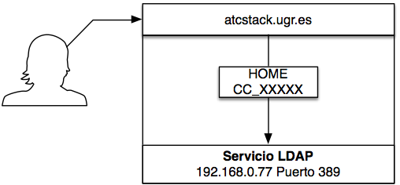

Asignatura Cloud Computing del Máster en Ingeniería Informática. 

Departamento de Ciencias de la Computación e Inteligencia Artificial.

Universidad de Granada.

<HR>

Profesor: **Manuel J. Parra-Royón**

Email: **manuelparra@decsai.ugr.es**

Tutorías: **Viernes, de 17:30 a 18:30, despacho D31 (4ª planta) Escuela Técnica Superior de Ingenierías Informática y de Telecomunicación (ETSIIT).**

Material de prácticas de la asignatura: **https://github.com/manuparra/PracticasCC**

<HR>


# Sesión : Despliegue de servicios en contenedores

Tabla de contenido:

  * [Requisitos iniciales](#requisitos-iniciales)
  * [Credenciales y acceso inicial](#credenciales-y-acceso-inicial)
  * [Acceso vía WEB](#acceso-v-a-web)
  * [Acceso vía SSH](#acceso-v-a-ssh)
  * [Despliegue y gestión de servicios de autenticación de usuarios](#despliegue-y-gesti-n-de-servicios-de-autenticaci-n-de-usuarios)
    + [Entrenando con LDAP](#entrenando-con-ldap)
    + [LDAP Basics](#ldap-basics)
    + [Objetos y clases](#objetos-y-clases)
    + [Atributos](#atributos)
    + [Entradas](#entradas)
    + [DIT](#dit)
    + [Distinguished name (dn). Nombre distinguido.](#distinguished-name--dn--nombre-distinguido)
    + [Ejemplo de la estructura de LDAP](#ejemplo-de-la-estructura-de-ldap)
  * [Verificando el estado del directorio LDAP](#verificando-el-estado-del-directorio-ldap)
    + [Añadir un nuevo usuario](#a-adir-un-nuevo-usuario)
  * [Cambiar el Password de un usuario en LDAP](#cambiar-el-password-de-un-usuario-en-ldap)
    + [Modificando cuentas de usuario con LDAP: DELETE, MODIFY.](#modificando-cuentas-de-usuario-con-ldap--delete--modify)
  * [Añadir una UO a LDAP:](#a-adir-una-uo-a-ldap-)
  * [Buscando y encontrado dentro del DIT](#buscando-y-encontrado-dentro-del-dit)
  * [Ejercicio: Crear un servicio de directorio LDAP en contendor dentro de una MV](#ejercicio--crear-un-servicio-de-directorio-ldap-en-contendor-dentro-de-una-mv)


## Requisitos iniciales

- Tener cuenta de acceso a atcstack.ugr.es.
- Conocimientos básicos del SHELL.
- Conceptos básicos de Cloud y Máquinas Virtuales.

## Credenciales y acceso inicial

Cada alumno tiene asignado un nombre de usuario y una clave que servirán para autenticarse dentro del cluster de OpenStack. 
El nombre de usuario y clave asignado a cada alumno se informará en la primera sesión de prácticas.

El acceso al cluster de OpenStack se realiza a través de los siguientes puntos de entrada (*es necesario estar conectado a la VPN de la UGR*):

- Entorno WEB OpenStack Horizon: http://atcstack.ugr.es/dashboard/auth/login/?next=/dashboard/
- Consola del cluster OpenStack: ssh usuario@atcstack.ugr.es

Para ambos es necesario utilizar las mismas credenciales de acceso.

## Acceso vía WEB

Para acceder vía web, utilizamos un navegador para la dirección:  http://atcstack.ugr.es/dashboard/auth/login/?next=/dashboard/


Por defecto en Domain, usamos ``default``

## Acceso vía SSH

Para usar SSH, utilízalo desde la consola de Linux o bien desde Windows usando la aplicación ``putty``.

Si usas Windows descarga ``putty`` desde: https://www.chiark.greenend.org.uk/~sgtatham/putty/latest.html e indica los siguientes datos en la pantalla de cofiguración:

- Hostname or IP: ``atcstack.ugr.es``
- Port: ``22``
- Connection Type: ``SSH``

Y luego ``Open`` para conectar, donde te pedirá despues las credenciales de acceso.

Si usas SSH desde una consola:

``ssh usuario@atcstack.ugr.es``


## Despliegue y gestión de servicios de autenticación de usuarios

Para esta sesión usaremos un servicio de LDAP ya creado dentro de ATCSTACK. Este servicio se encuentra en:

- Servidor de LDAP - IP: **192.168.0.77**
- Puertos del servicio: **389** y **636**

El servicio es compartido por todos los usuarios:



### Entrenando con LDAP

El paquete openldap-client instala herramientas que se utilizan para añadir, modificar y eliminar entradas en un directorio LDAP. Estas herramientas incluyen las siguientes:

* ldapadd - Añade entradas a un directorio LDAP aceptando entradas a través de un archivo o entrada estándar; ldapadd es en realidad un enlace duro para ldapmodify -a.

* ldapdelete - Borra las entradas de un directorio LDAP aceptando la entrada del usuario en un intérprete de comandos de shell o a través de un archivo.

* ldapmodify - Modifica las entradas en un directorio LDAP, aceptando la entrada a través de un archivo o entrada estándar.

* ldappasswd - Establece la contraseña para un usuario LDAP.

* ldapsearch - Busca entradas en un directorio LDAP usando un shell prompt.

* ldapcompare - Abre una conexión con un servidor LDAP, se une y realiza una comparación usando parámetros especificados.

* ldapwhoami - Abre una conexión a un servidor LDAP, se une, y realiza una operación whoami.

* ldapmodrdn - Abre una conexión a un servidor LDAP, vincula y modifica las RDNs de entradas.


### LDAP Basics

LDAP es un protocolo ligero para acceder a servidores de directorios. Vale, ¿qué es un servidor de directorios? Es una base de datos jerárquica orientada a objetos.

### Objetos y clases
Los datos en LDAP se almacenan en objetos. Estos objetos contienen varios atributos, que son básicamente un conjunto de pares clave/valor. Puesto que los datos en LDAP están estructurados, los objetos sólo pueden contener claves válidas y las claves válidas dependen de la clase del objeto. Las clases en LDAP pueden definir atributos obligatorios y opcionales y su tipo.


*Las clases se asignan a objetos utilizando el atributo objectClass. LDAP define por defecto algunas clases básicas, tipos y métodos de comparación, pero usted es libre de definir los suyos propios.*

### Atributos

Los datos mismos en un sistema LDAP se almacenan principalmente en elementos llamados atributos. Los atributos son básicamente pares clave-valor. A diferencia de otros sistemas, las claves tienen nombres predefinidos dictados por el objetoClases seleccionados para la entrada. Además, los datos de un atributo deben coincidir con el tipo definido en la definición inicial del atributo.


```
...
home: /home/mparra
...
```


### Entradas


Los atributos por sí mismos no son muy útiles. Para tener sentido, deben estar asociados con algo. Dentro de LDAP, se utilizan atributos dentro de una entrada. 

Una entrada es básicamente una colección de atributos bajo un nombre usado para describir algo.

```
# LDAP user entry example
dn: cn=mparra,ou=Users,dc=openstack,dc=org
objectClass: top
objectClass: account
objectClass: posixAccount
objectClass: shadowAccount
cn: mparra
...
```

### DIT

Un DIT es simplemente la jerarquía que describe la relación entre las entradas existentes. 

Al crear, cada nueva entrada debe "engancharse" al DIT existente colocándose como hijo de una entrada existente.

Esto crea una estructura similar a un árbol que se utiliza para definir relaciones de ordenación y asignar significado.

### Distinguished name (dn). Nombre distinguido.

Funciona como una ruta completa de regreso a la raíz de los árboles de información de datos, o DITs.

Por ejemplo, por ejemplo:

```
dn: cn=mparra,ou=Users,dc=openstack,dc=org
```

- cn: Common name

- ou: organizational segment / Organizational Unit

- dc = Domain Component

El padre directo es una entrada llamada ``ou=Users`` que se utiliza como contenedor para las entradas que describen a los usuarios.

Los padres de esta entrada derivan del nombre de dominio "openenstack.org", que funciona como la raíz de nuestro DIT.

Éstos se utilizan a menudo para las categorías generales bajo la entrada DIT de nivel superior, cosas como ``ou=personas, ou=grupos, y ou=inventario``` son los más comunes.


### Ejemplo de la estructura de LDAP


## Verificando el estado del directorio LDAP

Primero comprueba que estás dentro de ATCKSTACK o bien dentro de una de tus MVs (con las herramientas de LDAP instaladas):

Prueba: 

```
ldapsearch -H ldap://192.168.0.77 -LL -b ou=Users,dc=openstack,dc=org -x
```

Esto, imprime por pantalla el listado Usuarios del servicio de directorio.


```
...
dn: ou=Users,dc=openstack,dc=org
objectClass: organizationalUnit
ou: Users

dn: cn=Robert Smith,ou=Users,dc=openstack,dc=org
objectClass: inetOrgPerson
cn: Robert Smith
cn: Robert J Smith
cn: bob  smith
sn: smith
uid: rjsmith
carLicense: HISCAR 123
homePhone: 555-111-2222
mail: r.smith@example.com
mail: rsmith@example.com
mail: bob.smith@example.com
description: swell guy
ou: Human Resources
...
```

El formato de ``ldapsearch`` es: 

``ldapsearch -H <host> -LL -b ou=<Organizational Unit> -x``

La utilidad LDAP  ``ldaputility`` contiene muchas opciones y parámetros, revisa: https://www.centos.org/docs/5/html/CDS/ag/8.0/Finding_Directory_Entries-Using_ldapsearch.html


### Añadir un nuevo usuario

Para agregar algo al directorio LDAP, primero necesita crear un archivo LDIF.

El fichero ldif debe contener definiciones de todos los atributos necesarios para las entradas que desea crear.

Con este archivo ``ldif``, puede usar el comando ``ldapadd`` para importar las entradas al directorio como se explica en este tutorial.

Crear un archivo, es decir, ``user.ldif`` y copiar este esqueleto, modificar e incluir sus datos (es decir, ``cn=mparra`` a ``cn=<usuario>``, es decir, ``uid=mparra`` a ``uid=<uid>``, ``gecos`` etc.).


```
dn: cn=mparra,ou=Users,dc=openstack,dc=org
objectClass: top
objectClass: account
objectClass: posixAccount
objectClass: shadowAccount
cn: mparra
uid: mparra
uidNumber: 16859
gidNumber: 100
homeDirectory: /home/mparra
loginShell: /bin/bash
gecos: mparra
userPassword: {crypt}x
shadowLastChange: 0
shadowMax: 0
shadowWarning: 0
```

Para añadir el usuario a LDAP, usamos (a la rama openstack/org == openstack.org):

```
ldapadd -x -D "cn=admin,dc=openstack,dc=org" -w password -c -f user1.ldif
```

Forma de hacerlo:

```
ldapadd [options] [-f LDIF-filename]
```

Si eliminas ``-w password``, y lo cambias por ``-W`` preguntará la clave de admin de LDAP.


## Cambiar el Password de un usuario en LDAP

```
ldappasswd -s <new_user_password> -W -D "cn=admin,dc=openstack,dc=org" -x "cn=mparra,ou=Users,dc=openstack,dc=org"
```

En este caso , usamos la opcion -W , ``ldappasswd`` .

Syntax:

```
ldappasswd [ options ] [ user ]
```

Revisa: https://www.centos.org/docs/5/html/CDS/cli/8.0/Configuration_Command_File_Reference-Command_Line_Utilities-ldappasswd.html  para más información sobre el comando.

Ahora prueba:

```
ldapsearch -H ldap://localhost -LL -b ou=Users,dc=openstack,dc=org -x
```

Esto devolverá el directorio con el último usuario añadido.

### Modificando cuentas de usuario con LDAP: DELETE, MODIFY.

La sintaxis es la siguiente:

```
ldapmodify [ options ]

ldapmodify [ options ] < LDIFfile

ldapmodify [ options ] -f LDIFfile
```

Archivo de texto LDIF que contiene nuevas entradas o actualizaciones a entradas existentes en el directorio LDAP.

Al modificar el contenido de un directorio, debe cumplir varias condiciones previas. 

En primer lugar, el DN de enlace y la contraseña utilizados para la autenticación deben tener los permisos adecuados para las operaciones que se realizan.

Crear un ejemplo LDIF Modificar y guardar el archivo como ``mparra_modify.ldif```.


```
dn: cn=mparra,ou=Users,dc=openstack,dc=org
changetype: modify
replace: loginShell
loginShell: /bin/csh
```

Luego ejecuta: 

```
ldapmodify -x -D "cn=admin,dc=openstack,dc=org" -w password -H ldap:// -f mparra_modify.ldif
```

Actualizará ``cn=mparra`` con un nuevo ``loginShell``, en este caso ``/bin/csh```.

Comprueba que los cambios se han hecho: 

```
...
dn: cn=mparra,ou=Users,dc=openstack,dc=org
objectClass: top
objectClass: account
objectClass: posixAccount
objectClass: shadowAccount
cn: mparra
uid: mparra
uidNumber: 16859
gidNumber: 100
homeDirectory: /home/mparra
gecos: mparra
shadowMax: 0
shadowWarning: 0
loginShell: /bin/csh
...

```

Añade una entrada a un usuario LDAP. Crea un nuevo fichero ``manu_add_descrip.ldif`` y añade: 

```
dn: cn=mparra,ou=Users,dc=openstack,dc=org
changetype: modify
add: description
description: Manuel Parra
```

Ejecuta el siguiente comando:

```
ldapmodify -x -D "cn=admin,dc=openstack,dc=org" -w password -H ldap:// -f manu_add_descrip.ldif
```

Ahora, comprueba los cambios:


```
ldapsearch -H ldap://localhost -LL -b ou=Users,dc=openstack,dc=org -x
```

Y finalmente borra la descripción. Crea un nuevo dichero i.e. ``manu_del_descr.ldif``

```
dn: cn=mparra,ou=Users,dc=openstack,dc=org
changetype: modify
delete: description
``` 

Luego ejecuta: 

```
ldapmodify -x -D "cn=admin,dc=openstack,dc=org" -w password -H ldap:// -f manu_del_descr.ldif
```

Comprueba:

```
ldapsearch -H ldap://localhost -LL -b ou=Users,dc=openstack,dc=org -x
```

Verifica si la entidad ya no está.


## Añadir una UO a LDAP:

Crear un nuevo fichero ``ldif`` . i.e. ``add_new_ou.ldif`` con :

```
dn: ou=People,dc=openstack,dc=org
ou: People
objectClass: top
objectClass: organizationalUnit
description: Parent object of all PEOPLE accounts
```

Luego usa:

```
ldapadd -x -D cn=admin,dc=openstack,dc=org -w password -c -f add_new_ou.ldif
```

## Buscando y encontrado dentro del DIT

Por ejemplo, si usamos ``ou=People``

```
ldapsearch -H ldap://localhost -LL -b ou=People,dc=openstack,dc=org -x
```

Esto muestra todo lo que hay bajo desde ``ou=People`` hasta ``dc=openstack,dc=org``

Cualquier combinación de  ``ou``, ``dc``, ... está permitida para buscar dentro del DIT.


## Ejercicio: Crear un servicio de directorio LDAP en contendor dentro de una MV

Para este ejercicio es necesario crear o reutilizar una de las MVs que tengas disponibles para añadir:

- Servicio de contenedores docker. Instala Docker.
- Servicio de Directorio LDAP. Para ello instala dentro de docker:

```
docker pull larrycai/openldap
docker run -d -p 389:389 --name ldap -t larrycai/openldap
```

- Abre el puerto en las políticas de seguridad de OpenStack (desde Horizon), para poder acceder desde fuera al contenedor.
- Usa el comando para verificar que tu instalación es correcta.

```
ldapsearch -H ldap://<IP De tu MV> -LL -b ou=People,dc=openstack,dc=org -x
```

- Añade tu usuario a LDAP y incluye un atributo que sea Teléfono.


